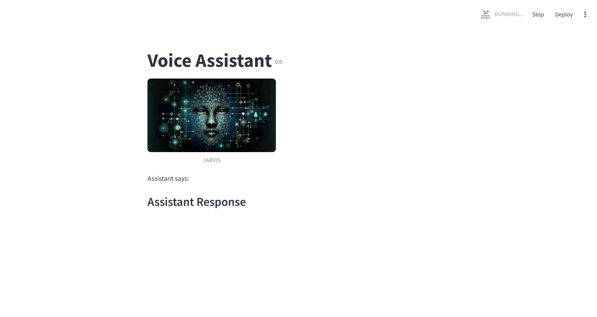

# Jarvis--AI-assistant
This project is a voice assistant powered by Python, integrating speech recognition, text-to-speech (TTS), and AI-driven conversational responses. It utilizes Streamlit for the UI, pyttsx3 for speech synthesis, and TinyLlama from Hugging Face for generating AI-based responses.

#Features

Speech Recognition: Converts spoken words into text using speech_recognition.

Text-to-Speech: Uses pyttsx3 to generate audio responses.

AI-Powered Conversations: Leverages TinyLlama to generate responses based on user input.

Task Execution: Opens applications like Google, VS Code, and PyCharm via voice commands.

Streamlit UI: Provides a web-based interface displaying assistant responses.

Multithreading: Runs in a separate thread for a smoother experience.

Installation

Prerequisites

Ensure you have Python 3.8+ installed.

Install Dependencies

pip install pyttsx3 speechrecognition torch transformers huggingface_hub streamlit

Usage

Run the assistant using:

streamlit run assistant.py

How It Works

Launch the application via Streamlit.

Speak a command into the microphone.

The assistant processes your speech and generates a response using TinyLlama.

The response is spoken aloud using pyttsx3 and displayed in the UI.

Supported Voice Commands

"How are you?"

"What do I have to do today?"

"Open Google"

"Open VS Code"

"Open Python"

"Also the web search"

"Exit" (Terminates the assistant)

"Contributing"

Feel free to fork and enhance the project by adding new functionalities.

"License"

This project is licensed under the MIT License.

Developer: Aryan Thapa
